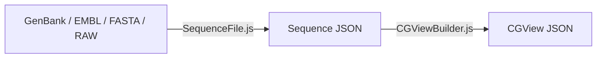
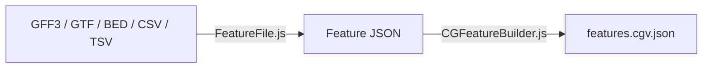

# CGParse.js

[](https://www.npmjs.com/package/cgparse)
[](LICENSE)
[](https://github.com/stothard-group/cgview-parse/actions)

Parsers and builders to convert biological sequence & feature files (GenBank, GFF3, BED, FASTA, etc.) into CGView-compatible JSON, with optional filtering and logging.

- **Parsers** (`SequenceFile.js`, `FeatureFile.js`): ingest raw text files → intermediate JSON  
- **Builders** (`CGViewBuilder.js`, `CGFeatureBuilder.js`): intermediate JSON → CGView JSON  
- **Logger** (`Logger.js`): structured logging (console + history) with levels, icons, timestamps  

👉 [Live Demo & Test Page](https://stothard-group.github.io/cgview-parse/)  

---

## Table of Contents

1. [Why CGParse.js?](#why-cgparsejs)  
2. [Installation](#installation)  
3. [Getting Started](#getting-started)  
   - [Sequence Files](#sequence-files)  
   - [Feature Files](#feature-files)  
4. [API Reference](#api-reference)  
   - [SequenceFile](#sequencefile)  
   - [FeatureFile](#featurefile)  
   - [CGViewBuilder](#cgviewbuilder)  
   - [CGFeatureBuilder](#cgfeaturebuilder)  
   - [Logger](#logger)  
5. [Building & Testing](#building--testing)  
6. [Contributing](#contributing)  
7. [Resources](#resources)  
8. [License](#license)  

---

## Why CGParse.js?

CGParse.js fills the gap between raw sequence/feature formats and interactive genome visualization:

- **Flexibility**: Support for GenBank, EMBL, GFF3, GTF, BED, CSV/TSV, FASTA, RAW  
- **Modularity**: Intermediate JSON can be consumed by other tools  
- **Filtering**: Easily include/exclude feature types & qualifiers  
- **Logging**: Built-in logger for reproducible pipelines  

---

## Installation

```bash
# via npm
npm install cgparse

# or yarn
yarn add cgparse
```

---

## Getting Started

### Sequence Files



```js
import { SequenceFile, CGViewBuilder } from 'cgparse';

const text = /* raw GenBank/FASTA/etc. text */;
const seqFile = new SequenceFile(text, {
  addFeatureSequences: false,  // default
  logger: undefined,
  maxLogCount: undefined
});

// Quick summary
console.log(seqFile.summary);
// Parse status
console.log(seqFile.status, seqFile.success);
// Convert to CGView JSON
const cgviewData = seqFile.toCGViewJSON();
```

### Feature Files



```js
import { FeatureFile, CGFeatureBuilder } from 'cgparse';

const gffText = /* raw GFF3 text */;
const featFile = new FeatureFile(gffText, { logger: myLogger });
console.log(featFile.records);

const builder = new CGFeatureBuilder(featFile, {
  includeTypes: ['gene','CDS'],  
  includeQualifiers: ['product','gene'],
});
const featuresJSON = builder.toJSON();
```

---

## API Reference

### `SequenceFile`

Parse sequence files into an intermediate JSON format.

#### Constructor

```ts
new SequenceFile(
  inputText: string,
  options?: {
    addFeatureSequences?: boolean; // default: false
    logger?: Logger;               // default: new Logger()
    maxLogCount?: number;          // default: unlimited
  }
)
```

#### Properties

- `records: Array<SequenceRecord>` — parsed sequences  
- `summary: { inputType, sequenceType, sequenceCount, featureCount, totalLength, status, success }`  
- `status: 'success' | 'failed'`  
- `success: boolean`  
- `logger: Logger`  

#### Methods

- `.toCGViewJSON(): object` — directly build CGView JSON  

---

### `FeatureFile`

Parse feature tables into JSON records.

#### Constructor

```ts
new FeatureFile(
  inputText: string,
  options?: {
    logger?: Logger;
    maxLogCount?: number;
  }
)
```

#### Properties

- `records: Array<FeatureRecord>`  
- `summary: { recordCount, featureTypes, status, success }`  
- `status: string`  
- `success: boolean`  
- `logger: Logger`  

#### Methods

- *(none; use builder to convert to CGView JSON)*  

---

### `CGViewBuilder`

Convert sequences → CGView JSON, with filtering.

#### Constructor

```ts
new CGViewBuilder(
  input: SequenceFile | string,
  options?: {
    config?: object;                   // custom CGView config
    skipTypes?: string[];              // default: ['gene','source','exon']
    includeQualifiers?: boolean|string[]; // default: false
    includeCaption?: boolean;          // default: true
    skipComplexLocations?: boolean;    // default: true
    maxLogCount?: number;
  }
)
```

#### Properties

- `status: 'success' | 'failed' | 'warnings'`  
- `success: boolean`  
- `logger: Logger`  
- `seqFile: SequenceFile`  

#### Methods

- `.toJSON(): object` — returns CGView JSON payload  

---

### `CGFeatureBuilder`

Convert feature JSON → CGView feature array.

#### Constructor & Options

_Same pattern as_ `CGViewBuilder`, but operates on `FeatureFile` records.

---

### `Logger`

Structured logging with levels, icons, timestamps, and history.

#### Constructor

```ts
new Logger({
  logToConsole?: boolean;   // default: true
  showTimestamps?: boolean; // default: true
  showIcons?: boolean;      // default: true
  maxLogCount?: number;     // default: unlimited
})
```

#### Methods

```js
logger.log('message');
logger.info('info message');
logger.warn('warning!');
logger.error('error occurred');
logger.break('---- separator ----');
```

#### Properties

- `count: number` — total logged messages  
- `.history(): Array<{ level, timestamp?, message }>`  

#### Example

```js
const lg = new Logger({ showIcons: true });
lg.info('Parsing started');
// ℹ️ Parsing started

console.table(lg.history());
```

---

## Building & Testing

```bash
# Build distributables
yarn build
# ➜ docs/dist/*

# Run test suite
yarn test
```

---

## Contributing

1. Fork the repo  
2. Create a feature branch (`git checkout -b my-feature`)  
3. Commit your changes (`git commit -am 'Add feature'`)  
4. Push to the branch (`git push origin my-feature`)  
5. Open a Pull Request  

Please follow the existing [code style](https://github.com/stothard-group/cgview-parse/blob/main/.eslintrc.js) and include unit tests for new functionality.

---

## Resources

- **SeqToJSON** (Python parser): https://github.com/paulstothard/seq_to_json  
- **ENA Web Features**: https://www.ebi.ac.uk/ena/WebFeat  
- **ENA EMBL Files**: https://www.ebi.ac.uk/ena/browser/view/CP027060  
- **TeselaGen bio-parsers**:  
  - https://github.com/TeselaGen/tg-oss/tree/master/packages/bio-parsers  

---

## License

This project is licensed under the **MIT License**. See the [LICENSE](LICENSE) file for details.
